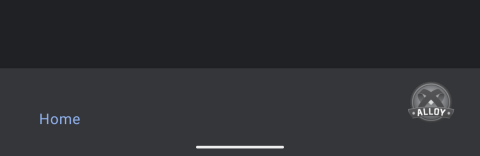

# ti.bottomNavView

Titanium Android module that allows you to add a custom view to a BottomNavigation:



## Install
```
<module>ti.bottomNavView</module>
```

## Method
* `require("ti.bottomNavView").addViewToBottomNav(view, tabgroup);`


## Example

```
<Alloy>
  <TabGroup style="Titanium.UI.Android.TABS_STYLE_BOTTOM_NAVIGATION" onOpen="onOpenTabs" id="tabgroup">
  		<Tab id="tab1" title="Home">
  			<Window />
  		</Tab>
  		<Tab id="tab2" title="Chat">
  			<Window />
  		</Tab>
  		<Tab id="tab3" title="Friends">
  			<Window />
  		</Tab>
  		<Tab id="tab4" title="">
  			<Window />
  		</Tab>
  	</TabGroup>
</Alloy>
```

```js
function onOpenTabs(e) {
	var v_outer = Ti.UI.createView({
		touchEnabled: false
	});
	var v = Ti.UI.createView({
		width: 40,
		height: 40,
		borderRadius: 20,
		backgroundImage: "/images/appicon.jpg",
		right: 20
	});
	v_outer.add(v);

  require("ti.bottomNavView").addViewToBottomNav(v_outer, $.tabgroup);
}

$.tabgroup.open();
```

## Hyperloop
For a hyperloop version check https://github.com/tidev/titanium_mobile/discussions/13423


## Author

- Michael Gangolf ([@MichaelGangolf](https://twitter.com/MichaelGangolf) / [Web](http://migaweb.de)) <span class="badge-buymeacoffee"><a href="https://www.buymeacoffee.com/miga" title="donate"></a></span>
